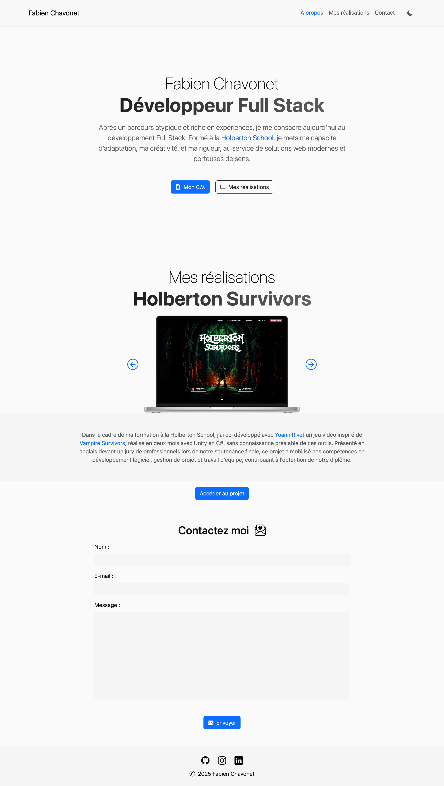
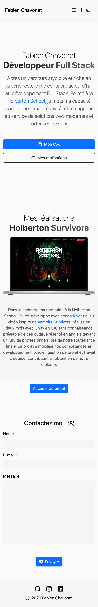

# Personal Website

## Table of contents

<details>
    <summary>
        CLICK TO ENLARGE 😇
    </summary>
    <a href="#description">Description</a>
    <br>
    <a href="#objectives">Objectives</a>
    <br>
    <a href="#tech-stack">Tech stack</a>
    <br>
    <a href="#files-description">Files description</a>
    <br>
    <a href="#installation_and_how_to_use">Installation and how to use</a>
    <br>
    <a href="#whats-next">What's next?</a>
    <br>
    <a href="#thanks">Thanks</a>
    <br>
    <a href="#authors">Authors</a>
</details>

## <span id="description">Description</span>

This project was developed as part of a live coding series (3 sessions) at Holberton School Toulouse.

The goal was to create a very simple and modest personal website, to show students that they can build something functional, responsive, and clean in just a few hours.

In Holberton’s second year, students are asked to create their own personal website in just 48 hours.
This live coding project demonstrates that, with a minimal amount of code and using Bootstrap, it is possible to achieve a decent result in a short timeframe.

It is not intended to be a full-featured portfolio, but rather a basic and modest example that students can use as a starting point.

Watch the live coding sessions here:

- [First live coding sessions (FR)](https://www.youtube.com/watch?v=IaD9aBu7st4).
- [Second live coding session (FR)](https://www.youtube.com/watch?v=pAuzjdw4u0w).
- Third live coding session (FR) - *Coming soon*.

## <span id="objectives">Objectives</span>

- Show how to quickly build a basic website with Bootstrap.
- Provide a minimal reference project for Holberton students.
- Practice working under time constraints (48 hours for the real project, ~4 hours for this demo).
- Keep the code as simple as possible, to stay accessible to beginners.

## <span id="tech-stack">Tech stack</span>

<p align="left">
    
    
    
    
    
    
    
    
</p>

## <span id="files-description">Files description</span>

| **FILES**    | **DESCRIPTION**                                     |
| :----------: | --------------------------------------------------- |
| `assets`     | Contains the resources required for the repository. |
| `index.html` | Main HTML structure for the project.                |
| `style.css`  | Styles and animations for the project.              |
| `script.js`  | Behavior script for interactivity.                  |
| `README.md`  | The README file you are currently reading 😉.       |

## <span id="installation_and_how_to_use">Installation and how to use</span>

### Installation:

1. Clone this repository:
    - Open your preferred Terminal.
    - Navigate to the directory where you want to clone the repository.
    - Run the following command:

```bash
git clone https://github.com/fchavonet/live_coding-personal_website.git
```

2. Open the repository you've just cloned.

### How to use:

1. Open the index.html file in your browser.

2. Explore the different sections of the website.

3. Modify the content to make it your own personal website!

You can also test the web application online by clicking [here](https://fchavonet.github.io/live_coding-personal_website/). 

<table>
    <tr>
        <th align="center" style="text-align: center;">Desktop view</th>
        <th align="center" style="text-align: center;">Mobile view</th>
    </tr>
    <tr valign="top">
        <td align="center">
            <picture>
                <source media="(prefers-color-scheme: dark)" srcset="./assets/images/screenshots/page_screenshot-dark.webp">
                <source media="(prefers-color-scheme: light)" srcset="./assets/images/screenshots/page_screenshot-light.webp">
                
            </picture>
        </td>
        <td align="center">
            <picture>
                <source media="(prefers-color-scheme: dark)" srcset="./assets/images/screenshots/mobile_page_screenshot-dark.webp">
                <source media="(prefers-color-scheme: light)" srcset="./assets/images/screenshots/mobile_page_screenshot-light.webp">
                
            </picture>
        </td>
    </tr>
</table>

## <span id="whats-next">What's next?</span>

- Add new sections (e.g., skills, tech stack...).  
- Externalize projects data into a separate file instead of keeping it directly in the JS script.  
- Improve the overall UI while keeping the minimalist approach.  

## <span id="thanks">Thanks</span>

- I would like to thank all those who participated or helped to carry out this project.
- Special thanks to those who provided feedback during and after the sessions.

## <span id="authors">Authors</span>

**Fabien CHAVONET**
- GitHub: [@fchavonet](https://github.com/fchavonet)
